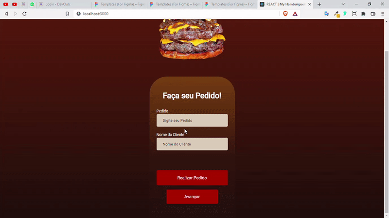
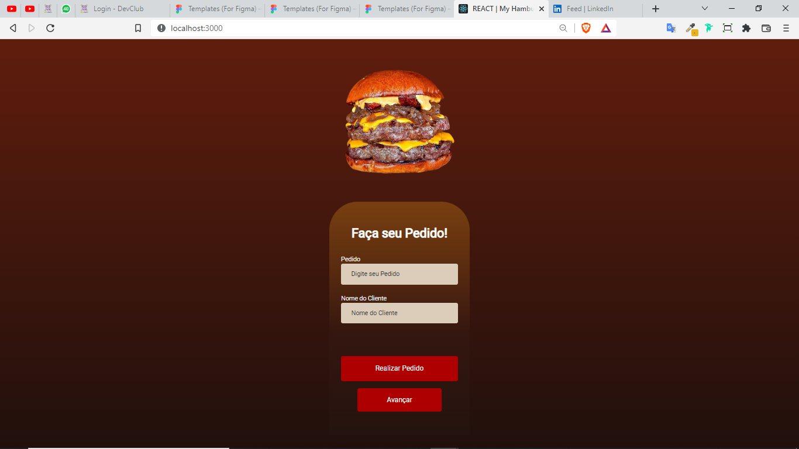
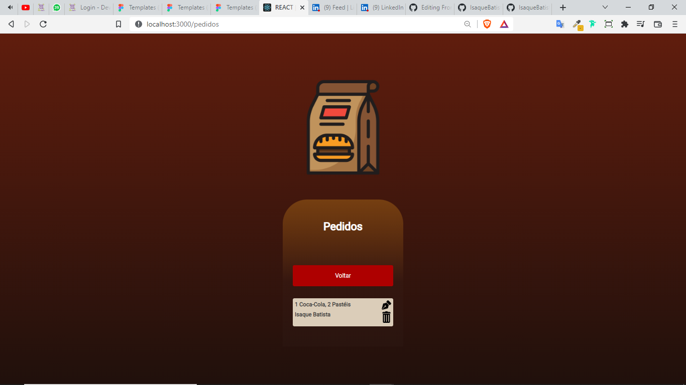
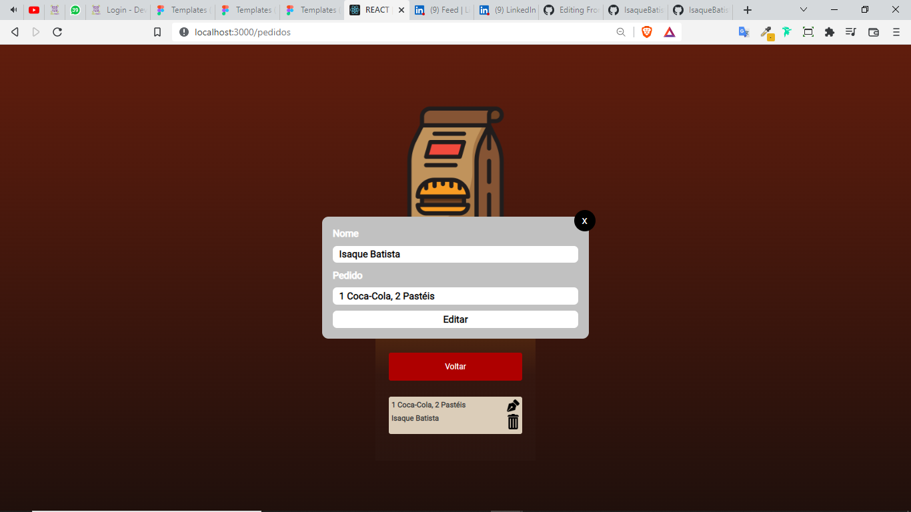

<h1>Projeto Hamburgueria</h1>

 
 

  

<h3>Home</h3>

  

<h3>Requests</h3>

  

<h3>Edit Requests</h3>

 

> In it you can register, edit and delete one or more requests. 

 

 - Project made with React.

 
   
## 🤝 Contributors

We thank the following people who contributed to this project:

<table>
  <tr>
      <td align="center">
          <a href="#">
                 
                
                <b>Isaque Batista</b>
                
         </a>
      </td>
            <td align="center">
          <a href="https://github.com/Dev-Pedrosv">
                 
                
                <b>Pedro Henrique</b>
                
         </a>
      </td>
  </tr>
</table>